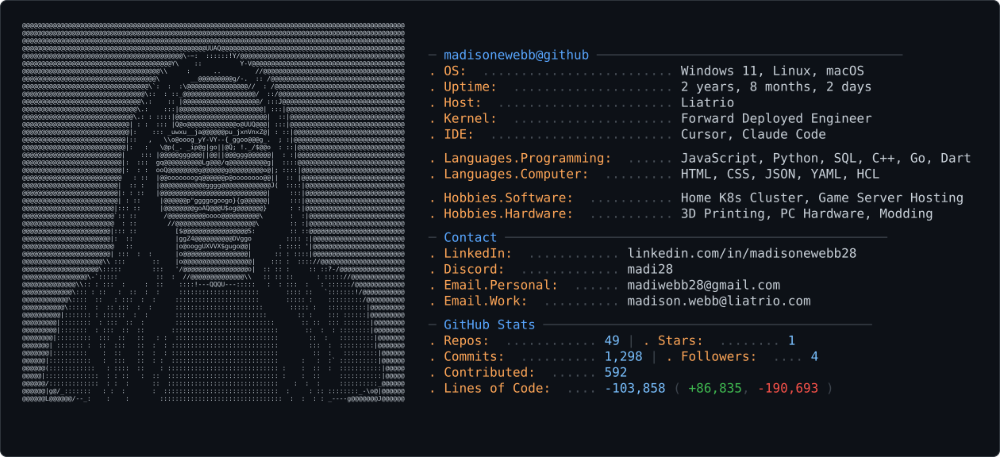

<picture>
  <source media="(prefers-color-scheme: dark)" srcset="dark_mode.svg" />
  <source media="(prefers-color-scheme: light)" srcset="light_mode.svg" />
  
</picture>

## About Me
- **Forward Deployed Engineer** at **Liatrio**, graduating **California State University, Chico** in 2026 with a B.S. in Computer Science.
- Passionate about bridging DevOps and development — hands-on with CI/CD, cloud, and infrastructure automation.
- Outside of work: 3D printing, computer hardware, running a home Kubernetes cluster, hosting dedicated gaming servers, and modding.

## Featured Projects

### [shopkeep](https://github.com/madisonewebb/shopkeep)
A multi-tenant Discord bot that posts Etsy order notifications to your server. Each Discord server connects to its own Etsy shop via OAuth, polls for new orders, and posts them as Discord embeds. Built with Python. Live at [shopkeepbot.com](https://shopkeepbot.com).

### [djsongmatch](https://github.com/madisonewebb/ChicoState/djsongmatch)
A web-based tool for DJs that recommends song transitions using harmonic compatibility (Camelot wheel), BPM analysis, and an artificial neural network (ANN) algorithm. Built with **Next.js** and a **Flask**/SQL backend.

## Skills & Technologies
| Category              | Tools & Languages                                                     |
|------------------------|------------------------------------------------------------------------|
| **Programming**        | JavaScript, Python, SQL, C++, Go, Dart                                 |
| **AI**                 | Cursor, Claude (CCA-F certified)                                       |
| **IaC**                | Terraform, Terragrunt, Ansible                                         |
| **CI/CD**              | GitHub Actions, Jenkins, Docker                                        |
| **Cloud Platforms**    | AWS, Azure                                                              |
| **Frontend / Backend** | Next.js, Flask                                                          |
| **Other Interests**    | Home Kubernetes cluster, dedicated game server hosting, 3D printing, PC hardware & modding |

## Contact
- **LinkedIn:** [linkedin.com/in/madisonewebb28](https://linkedin.com/in/madisonewebb28)
- **Email:** madiwebb28@gmail.com · madison.webb@liatrio.com
